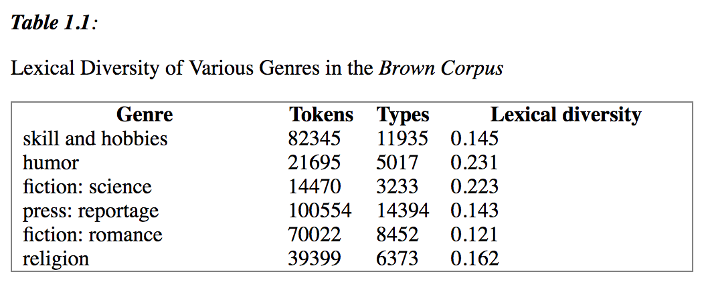
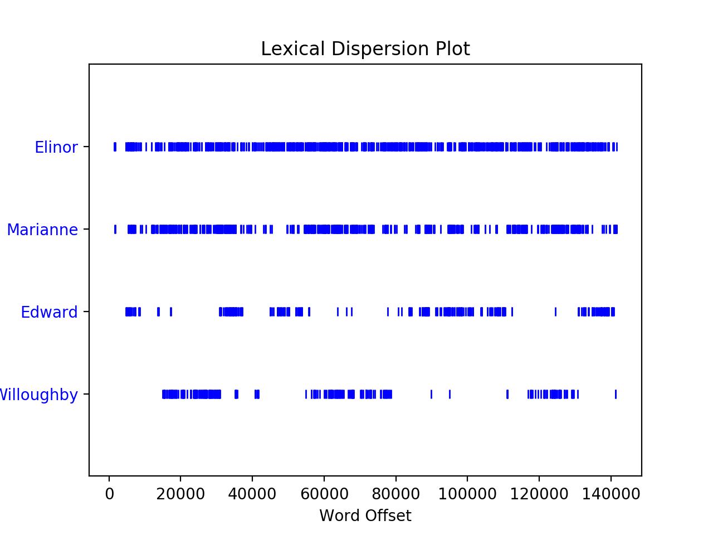

Emily Holt  
CS150 - Working with Corpora  
Professor Gregory Crane  
September 17, 2018

# Assignment 1

##### 5. Compare the lexical diversity scores for humor and romance fiction in 1.1. Which genre is more lexically diverse?


The table illustrates that humor genre is more lexically diverse than the romance fiction genre.


##### 6. Produce a dispersion plot of the four main protagonists in Sense and Sensibility: Elinor, Marianne, Edward, and Willoughby. What can you observe about the different roles played by the males and females in this novel? Can you identify the couples?


We can observe that Elinor and Marianne are the central protagonists, which fits the theme of Jane Austen's feminist narratives. Though Elinor mentions appear to overlap with both Edward and Willoghby, the plot indicates the Marianne and Willoughby have more overlapping mentions than Marianne and Edward. These observations mirror the actual couples in the novel. 

##### 17. Use text9.index() to find the index of the word sunset. You'll need to insert this word as an argument between the parentheses. By a process of trial and error, find the slice for the complete sentence that contains this word.
```
>>> text9.index("sunset")
629
>>> text9[629:659]
['sunset', 'side', 'of', 'London', ',', 'as', 'red', 'and', 'ragged', 'as', 'a', 'cloud', 'of', 'sunset', '.', 'It', 'was', 'built', 'of', 'a', 'bright', 'brick', 'throughout', ';', 'its', 'sky', '-', 'line', 'was', 'fantastic']
>>> text9[629:643]
['sunset', 'side', 'of', 'London', ',', 'as', 'red', 'and', 'ragged', 'as', 'a', 'cloud', 'of', 'sunset']
>>> text9[629:644]
['sunset', 'side', 'of', 'London', ',', 'as', 'red', 'and', 'ragged', 'as', 'a', 'cloud', 'of', 'sunset', '.']
>>> text9[620:644]
['PARK', 'THE', 'suburb', 'of', 'Saffron', 'Park', 'lay', 'on', 'the', 'sunset', 'side', 'of', 'London', ',', 'as', 'red', 'and', 'ragged', 'as', 'a', 'cloud', 'of', 'sunset', '.']
>>> text9[615:644]
['THE', 'TWO', 'POETS', 'OF', 'SAFFRON', 'PARK', 'THE', 'suburb', 'of', 'Saffron', 'Park', 'lay', 'on', 'the', 'sunset', 'side', 'of', 'London', ',', 'as', 'red', 'and', 'ragged', 'as', 'a', 'cloud', 'of', 'sunset', '.']
>>> text9[621:644]
['THE', 'suburb', 'of', 'Saffron', 'Park', 'lay', 'on', 'the', 'sunset', 'side', 'of', 'London', ',', 'as', 'red', 'and', 'ragged', 'as', 'a', 'cloud', 'of', 'sunset', '.']
```

The complete sentece appears to be: "THE suburb of Saffron Park lay on the sunset side of London, as red and ragged as a cloud of sunset."

##### 18.Using list addition, and the set and sorted operations, compute the vocabulary of the sentences sent1 ... sent8.

```
>>> sent_corpus = sent1 + sent2 + sent3 + sent4 + sent5 + sent6 + sent7 + sent8
>>> len(set(sorted(sent_corpus)))
75
```

##### 19.What is the difference between the following two lines? Which one will give a larger value? Will this be the case for other texts?
```
>>> len(sorted(set(w.lower() for w in text1)))
17231
>>> len(sorted(w.lower() for w in set(text1)))
19317
```
The first line `sorted(set(w.lower() for w in text1))` gets every word in the text, converts every word to lowercase, then squashes out the duplicates, then sorts. The second line `sorted(w.lower() for w in set(text1))` squashes out duplicates in the text, then converts every word in the set to lowercase, then sorts. The `set` function is cae sensitive, and thus does not count "yes" and "Yes" as duplicates. So in the second line, running `set` on text will return a case sensitive list with all the unique words and running `w.lower` on that list will inevitably return some duplicates for long-enough texts. The first line gets every word in the list, then converts them all to lowercase. So now the entire list is all the words in all the same case. Only then do we run `set` and squash out all the duplicates, returning a true representation of the unique vocabulary used in the text.  

If an input text is sufficiently long, it will almost certainly have the same word   appear starting with both an uppercase letter and a lowercase letter. This kind of text will display the same phenomenon where the first line of code would return a smaller number than the second line of code. For short-enough texts where no words appears with both an uppercase starting letter and a lowercase starting letter, the two lines of code would return the same number.


